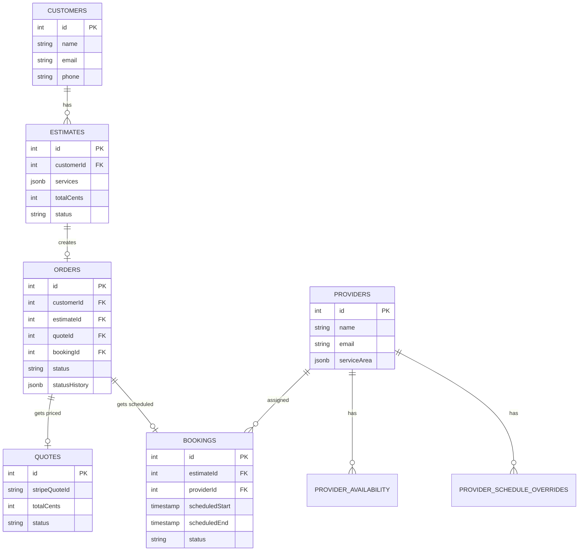

# HMLS Autos

Mobile mechanic service platform — AI-powered estimates, Stripe payments, provider scheduling.

## Architecture

| App                     | Stack       | Deploy      |
| ----------------------- | ----------- | ----------- |
| `apps/web`              | Next.js     | Vercel      |
| `apps/api`              | Deno + Hono | Deno Deploy |
| `apps/fixo-web`         | Next.js     | Vercel      |
| `apps/agent` (fixo)     | Deno + Hono | Deno Deploy |

**Shared:** Supabase (Postgres), Drizzle ORM, Stripe, Resend, AG-UI protocol

## Order Flow

```mermaid
stateDiagram-v2
    [*] --> estimated : Customer chats → agent creates estimate

    estimated --> customer_approved : Customer approves via portal
    estimated --> customer_declined : Customer declines

    customer_approved --> quoted : Admin creates Stripe quote

    quoted --> accepted : Customer pays via Stripe
    quoted --> declined : Customer declines quote

    accepted --> scheduled : Booking created

    scheduled --> in_progress : Service begins

    in_progress --> completed : Service finished

    estimated --> cancelled : Cancelled
    customer_approved --> cancelled : Cancelled
    quoted --> cancelled : Cancelled
    accepted --> cancelled : Cancelled
    scheduled --> cancelled : Cancelled

    customer_declined --> [*]
    declined --> [*]
    cancelled --> [*]
    completed --> [*]
```



### Entity Relationships



## Development

```bash
# Web app
cd apps/web && pnpm dev

# API agent
cd apps/api && deno task dev

# Fixo web
cd apps/fixo-web && bun dev

# Fixo agent
cd apps/agent && deno task dev
```
